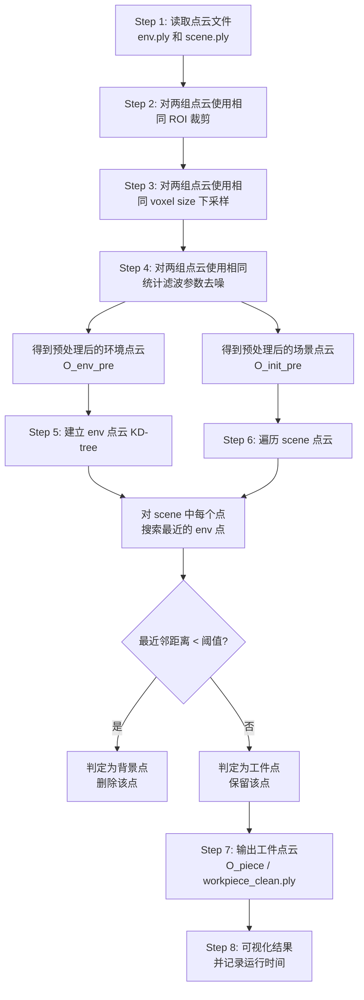
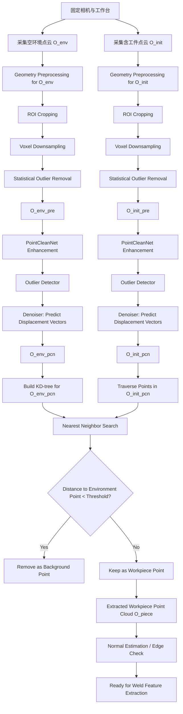
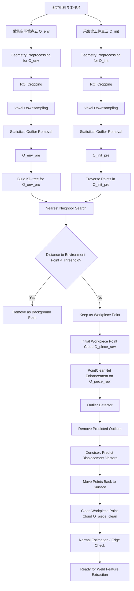

# 点云预处理与工件提取调研文档

## Baseline：基于东北大学论文的传统几何方法

## Supplement：基于 PointCleanNet 的学习型点云去噪方法

---

## 1. 调研目标

本调研面向 3D 点云下的工件提取、点云预处理与后续焊缝特征提取任务。当前项目需要从工业 3D 相机采集到的原始点云中去除噪声、降低点数、排除背景环境干扰，并尽量保留工件边缘、角点和高曲率区域等关键几何特征。

本调研将采用两条路线进行整理：

1. **Baseline 路线**：参考东北大学《基于 3D 点云的平面角接焊缝特征提取与运动跟踪》中的传统几何方法，作为当前阶段主要落地实现方案。
2. **Supplement 路线**：参考 PointCleanNet 论文中的学习型点云去噪方法，作为后续增强方案，用于复杂噪声场景下的去噪和特征保持。

总体判断如下：

* 当前阶段优先采用 **传统几何 baseline**，因为它不依赖训练数据，实现成本较低，可解释性强，适合工程落地。
* PointCleanNet 可作为后续补充，因为它在中高噪声下表现较好，但需要 paired noisy-clean point clouds 和 outlier labels，训练数据准备成本较高。

---

# Part I. Baseline：东北大学传统几何路线

## 2. Baseline 总体技术路线

东北大学论文提出的整体系统流程可以概括为：

```text
3D 点云采集
↓
点云预处理
↓
差异点云分割
↓
待焊工件点云提取
↓
工件结构分割
↓
焊缝特征点提取
↓
NURBS / 空间圆路径拟合
↓
焊枪姿态估计
↓
机器人自动焊接
```

对于本项目当前负责的“点云预处理与工件提取”部分，建议采用下面这条 baseline pipeline：

```text
Step 1: 采集空环境点云 O_env ✅
Step 2: 采集含工件点云 O_init ✅
Step 3: ROI 裁剪
Step 4: 体素下采样
Step 5: 统计离群点去除
Step 6: 差异点云分割
Step 7: 输出工件点云 O_piece
Step 8: 提供给后续焊缝特征提取模块
```

核心思想是：

```text
含工件场景点云 - 空环境点云 = 工件点云
```

---

## 3. Step 1：采集空环境点云

### 3.1 输入

在工作台上不放置工件，仅采集工作台、夹具和周围环境的点云，记为：

```math
O_{env}
```

### 3.2 作用

空环境点云作为背景模板，用于后续和含工件点云进行差异比较。

### 3.3 注意事项

为了保证差异分割有效，需要满足：

```text
相机位置固定
工作台位置固定
采集坐标系一致
环境光照和背景尽量稳定
```

如果相机或工作台发生移动，两个点云无法直接对齐，差异点云分割会出现大量误判。

---

## 4. Step 2：采集含工件点云

### 4.1 输入

在同一相机和工作台环境下放置待焊工件，采集含工件的初始点云，记为：

```math
O_{init}
```

该点云包含：

```text
工作台点云 + 背景点云 + 工件点云 + 噪声点
```

### 4.2 目标

后续需要从 `O_init` 中提取真正属于工件的点云，得到：

```math
O_{piece}
```

---

## 5. Step 3：ROI 裁剪

## 5.1 含义

ROI 是 Region of Interest，即感兴趣区域。
原始点云中可能包含墙面、地面、机器人、工作台外侧等无关点。ROI 裁剪就是用一个三维包围盒，只保留工件所在的大致空间区域。

### 5.2 数学描述

设点云中的点为：

```math
p_i = (x_i, y_i, z_i)
```

设定 ROI 范围：

```math
x_{min} \leq x_i \leq x_{max}
```

```math
y_{min} \leq y_i \leq y_{max}
```

```math
z_{min} \leq z_i \leq z_{max}
```

满足上述条件的点被保留，否则删除。

### 5.3 伪代码

```python
def crop_roi(pcd, x_min, x_max, y_min, y_max, z_min, z_max):
    cropped_points = []

    for p in pcd.points:
        x, y, z = p

        if x_min <= x <= x_max and y_min <= y <= y_max and z_min <= z <= z_max:
            cropped_points.append(p)

    return cropped_points
```

### 5.4 为什么两组点云都要裁剪？

空环境点云 `O_env` 和含工件点云 `O_init` 必须使用相同 ROI 参数：

```text
O_env  → 同样 ROI 裁剪 → O_env_roi
O_init → 同样 ROI 裁剪 → O_init_roi
```

如果两组点云裁剪范围不同，后续差分时会出现背景点误保留或工件点误删除。

---

## 6. Step 4：体素下采样

## 6.1 含义

工业 3D 相机采集的点云通常点数非常大。东北大学论文中提到，RVCX3D 相机采集到的点云数量可达到 230 多万个点，直接处理会严重影响算法效率。

体素下采样的思想是：把三维空间划分为许多小立方体，每个体素中只保留一个代表点，从而减少点云数量。

### 6.2 普通体素下采样

普通体素下采样通常计算体素内所有点的重心：

```math
c_v = \frac{1}{N_v} \sum_{p_i \in V} p_i
```

其中：

* `V` 表示一个体素；
* `N_v` 表示该体素中的点数；
* `c_v` 表示体素内点的重心。

然后用该重心代替体素内所有点。

### 6.3 普通体素下采样的问题

普通方法生成的重心点不一定是原始点云中真实存在的点，因此可能破坏原始点云的细小几何特征，尤其是边缘、焊缝附近细节和高曲率区域。

### 6.4 东北大学论文中的改进方法

东北大学论文采用“以邻近点为目标的体素滤波”。

步骤如下：

1. 将空间划分为若干体素；
2. 计算每个体素内所有点的重心 `c_v`；
3. 不直接保留重心，而是选择体素中距离重心最近的原始点：

```math
p_v^* = \arg\min_{p_i \in V} \|p_i - c_v\|
```

4. 用 `p_v^*` 作为该体素的代表点。

### 6.5 优点

该方法既减少了点数，又保留了原始采样点，因此比普通体素重心法更有利于保存细小几何特征。

### 6.6 伪代码

```python
def voxel_downsample_nearest_to_centroid(points, voxel_size):
    voxel_dict = {}

    for p in points:
        voxel_index = (
            int(p.x / voxel_size),
            int(p.y / voxel_size),
            int(p.z / voxel_size)
        )

        if voxel_index not in voxel_dict:
            voxel_dict[voxel_index] = []

        voxel_dict[voxel_index].append(p)

    downsampled_points = []

    for voxel, voxel_points in voxel_dict.items():
        centroid = mean(voxel_points)

        nearest_point = min(
            voxel_points,
            key=lambda p: distance(p, centroid)
        )

        downsampled_points.append(nearest_point)

    return downsampled_points
```

### 6.7 参数建议

初始可以设置：

```text
voxel_size = 1 mm ~ 3 mm
```

如果点数过多、运行速度慢，可以适当增大 `voxel_size`。
如果焊缝边缘或角点被抹掉，应减小 `voxel_size`。

---

## 7. Step 5：统计离群点去除

## 7.1 含义

统计离群点去除用于删除孤立噪声点、漂浮点和扫描异常点。

核心思想是：

> 正常点周围应该有较多邻居，离群点通常距离周围点较远。

### 7.2 邻域平均距离公式

对点 `p_i`，搜索其 `k` 个邻近点，计算平均距离：

```math
\bar{d_i} = \frac{1}{k} \sum_{j=1}^{k} d_{ij}
```

其中：

* `k` 是邻近点数量；
* `d_{ij}` 是点 `p_i` 到第 `j` 个邻近点的距离；
* `\bar{d_i}` 是点 `p_i` 的邻域平均距离。

### 7.3 离群点判断

假设所有点的邻域平均距离近似服从高斯分布，计算全局均值和标准差：

```math
\mu = mean(\bar{d_i})
```

```math
\sigma = std(\bar{d_i})
```

如果：

```math
\bar{d_i} > \mu + \alpha \sigma
```

则认为点 `p_i` 是离群点，将其删除。

其中 `\alpha` 是标准差倍数阈值，也可以理解为滤波严格程度。

### 7.4 参数解释

```text
k / nb_neighbors：每个点看多少个邻居
alpha / std_ratio：离群点判断阈值
```

建议初始设置：

```text
nb_neighbors = 20 ~ 30
std_ratio = 1.5 ~ 2.0
```

### 7.5 参数影响

| 参数设置              | 影响                  |
| ----------------- | ------------------- |
| `std_ratio` 较小    | 过滤严格，噪声删得多，但可能误删边缘  |
| `std_ratio` 较大    | 过滤宽松，边缘保留较好，但噪声可能残留 |
| `nb_neighbors` 较小 | 对局部细节敏感，但容易误判       |
| `nb_neighbors` 较大 | 更稳定，但可能抹掉局部细节       |

### 7.6 伪代码

```python
def statistical_outlier_removal(points, k=30, std_ratio=1.5):
    mean_distances = []

    for p in points:
        neighbors = knn_search(points, p, k)
        avg_dist = mean([distance(p, q) for q in neighbors])
        mean_distances.append(avg_dist)

    mu = mean(mean_distances)
    sigma = std(mean_distances)

    clean_points = []

    for p, avg_dist in zip(points, mean_distances):
        if avg_dist <= mu + std_ratio * sigma:
            clean_points.append(p)

    return clean_points
```

### 7.7 东北大学论文中的补充策略

东北大学论文还采用了基于距离的剔除策略：

* 对于较远的点，使用较大的邻域和较宽松的标准差阈值；
* 对于靠近滤波点的点云，使用较小邻域和更严格阈值，以保留更多细节。

这一点说明在实际工业点云中，滤波参数可以根据距离或区域自适应调整。

---

## 8. Step 6：差异点云分割

## 8.1 含义

差异点云分割是东北大学 baseline 中最关键的工件提取方法。

它利用空环境点云 `O_env` 和含工件点云 `O_opt` 之间的差异，将背景环境点删除，仅保留新出现的工件点。

### 8.2 输入

经过预处理后的两组点云：

```math
O_{env}
```

```math
O_{opt}
```

其中：

* `O_env` 是空环境点云；
* `O_opt` 是含工件点云经过预处理后的点云。

### 8.3 核心判断逻辑

对 `O_opt` 中每个点 `p_i`，在 `O_env` 中寻找最近邻点 `q_j`：

```math
q_j = NN(p_i, O_{env})
```

计算欧氏距离：

```math
d_i = \|p_i - q_j\|
```

设定距离阈值 `\tau`：

```math
if \ d_i < \tau:
    p_i 属于环境点，删除
else:
    p_i 属于工件点，保留
```

最终得到工件点云：

```math
O_{piece} = \{p_i \in O_{opt} \mid \min_{q_j \in O_{env}} \|p_i - q_j\| > \tau \}
```

### 8.4 KD-tree 加速

如果直接计算每个点到环境点云所有点的距离，复杂度很高。
因此 baseline 采用 KD-tree 加速最近邻搜索。

```text
建立 O_env 的 KD-tree
对 O_opt 中每个点查询最近邻
根据距离阈值判断是否删除
```

### 8.5 伪代码

```python
def differential_segmentation(scene_points, env_points, threshold):
    env_kdtree = build_kdtree(env_points)

    workpiece_points = []

    for p in scene_points:
        q = env_kdtree.nearest_neighbor(p)
        d = distance(p, q)

        if d > threshold:
            workpiece_points.append(p)

    return workpiece_points
```

### 8.6 阈值建议

阈值可以和体素大小绑定：

```math
\tau = 2 \sim 3 \times voxel\_size
```

例如：

```text
voxel_size = 2 mm
threshold = 4 mm ~ 6 mm
```

### 8.7 潜在问题

| 问题          | 原因        | 解决方案                 |
| ----------- | --------- | -------------------- |
| 背景残留        | 阈值太小      | 增大差分阈值               |
| 工件靠近桌面区域被删除 | 阈值太大      | 减小差分阈值               |
| 差分错位        | 相机或工件位置变化 | 固定相机，必要时做 ICP 配准     |
| 工件边缘缺失      | 预处理过强     | 减小 voxel size，放宽统计滤波 |

---

## 9. Step 7：工件结构分割与焊缝特征提取

工件点云 `O_piece` 得到后，东北大学论文继续进行焊缝特征提取。虽然这部分可能不是当前模块的主责，但需要理解它和预处理的关系。

### 9.1 RANSAC 平面提取

对于平面角接焊缝，工件通常包含一个主要平面和另一部分曲面或竖直面。论文先用 RANSAC 从 `O_piece` 中提取平面。

平面方程：

```math
A_1x + B_1y + C_1z + D_1 = 0
```

对点 `p_i = (x_i, y_i, z_i)`，其到平面的距离可表示为：

```math
d_i = \frac{|A_1x_i + B_1y_i + C_1z_i + D_1|}{\sqrt{A_1^2 + B_1^2 + C_1^2}}
```

判断：

```text
如果 d_i <= d_max，则为平面内点
如果 d_i > d_max，则为平面外点
```

RANSAC 多次随机采样 3 个点拟合平面，选择内点数量最多的平面模型。

最终得到平面点云：

```math
O_A
```

以及剩余点云：

```math
O_{left}
```

### 9.2 平面法向量

提取平面后，其单位法向量为：

```math
n_1 = \frac{(A_A, B_A, C_A)}{\sqrt{A_A^2 + B_A^2 + C_A^2}}
```

该法向量后续用于焊枪姿态估计。

---

## 10. Step 8：边缘检测

东北大学论文的边缘检测基于局部邻域几何属性。

### 10.1 邻域搜索

对点 `P_j`，搜索半径 `r` 内的邻域点：

```math
N(P_j) = \{P_k \mid P_k \in O_{final}, \|P_jP_k\| < r\}
```

### 10.2 局部最佳拟合平面

对邻域点拟合局部平面：

```math
ax + by + cz = d
```

且：

```math
a^2 + b^2 + c^2 = 1
```

点到平面距离：

```math
d_j = |ax_j + by_j + cz_j - d|
```

目标是最小化所有点到局部平面的距离平方和：

```math
e = \sum_{j=1}^{n} d_j^2 \rightarrow min
```

该问题可转化为协方差矩阵的特征值问题：

```math
Ax = \lambda x
```

其中最小特征值对应的特征向量即为局部平面的法向量。

### 10.3 判断边缘点

将邻域点投影到局部切平面上，以中心点 `P_j` 为角点，计算相邻投影点之间的夹角集合：

```math
\theta = \{\theta_1, \theta_2, ..., \theta_m\}
```

取最大夹角：

```math
\theta_{max} = max(\theta)
```

若：

```math
\theta_{max} \geq \xi
```

则判断 `P_j` 为边缘点。

所有边缘点组成：

```math
O_{bdy}
```

### 10.4 焊缝特征点提取

根据论文思路，焊缝特征点位于主平面 `O_A` 和边缘点云 `O_bdy` 相互距离较近的位置。

判断方式：

```math
O_{ftr} = \{p_i \mid p_i \in O_A \cup O_{bdy}, \ distance(p_i, O_{bdy} \ or \ O_A) < \epsilon \}
```

最终得到焊缝特征点云：

```math
O_{ftr}
```

---

## 11. Step 9：路径拟合与姿态估计

### 11.1 NURBS 曲线拟合

对于直线、折线和平面曲线角接焊缝，论文采用 NURBS 曲线拟合离散焊缝特征点，使路径更加平滑。

输入：

```math
O_{ftr}
```

输出：

```math
O_{tj}
```

其中 `O_tj` 表示拟合并等距采样后的焊接路径点。

### 11.2 空间圆拟合

对于圆柱与平面形成的角接焊缝，焊缝路径可能是空间圆的一部分。论文采用改进 RANSAC 进行空间三维圆拟合。

### 11.3 焊枪姿态估计

给定第 `k` 个路径点和第 `k+1` 个路径点，焊枪末端坐标系的 `n` 轴方向为路径切向方向：

```math
I_{vn} = \frac{L_{P_kP_{k+1}}}{|L_{P_kP_{k+1}}|}
```

根据角接焊缝工艺要求，理想工作角为 45°，将平面法向量 `n_1` 绕路径切向方向旋转：

```math
\theta = \frac{\pi}{4}
```

焊枪末端坐标系的 `a` 轴方向为：

```math
I_{va} = (1 - cos\theta)(n_1 \times v_n) \times v_n + n_1 cos\theta + v_n \times n_1 sin\theta
```

第三个方向向量：

```math
I_{vo} = I_{va} \times I_{vn}
```

由此得到每个路径点的焊枪姿态。

---

## 12. Baseline 实验结果总结

东北大学论文的实验结果显示：

### 12.1 预处理算法对比

与传统体素滤波相比，论文提出的邻近点目标体素滤波在简单直线焊缝上的平均距离偏差更小：

```text
本文算法平均距离偏差：0.287 mm
传统算法平均距离偏差：0.388 mm
```

说明改进体素滤波更有利于保留细小特征。

### 12.2 整体精度

不同类型角接焊缝的最大误差不超过：

```text
1 mm
```

### 12.3 运行时间

预处理平均时间：

```text
7.015 s
```

工件提取平均时间：

```text
8.359 s
```

工件提取后，不同焊缝路径提取时间约为：

```text
0.594 s ~ 2.118 s
```

总耗时不超过：

```text
18 s
```

### 12.4 Baseline 优点

```text
不需要训练数据
流程可解释
适合固定相机和固定工位
能完成从环境中提取工件
对后续焊缝提取友好
```

### 12.5 Baseline 局限

```text
依赖阈值和手工参数
相机或环境变化会影响差分效果
复杂噪声下鲁棒性有限
过度滤波可能损失边缘细节
对非固定场景适应性不足
```

---

# Part II. Supplement：PointCleanNet 学习型补充路线

## 13. PointCleanNet 总体思想

PointCleanNet 是一个学习型点云清洗方法，主要解决两个问题：

```text
outlier removal：删除离群点
denoising：将噪声点移动回真实表面
```

它的核心流程是：

```text
Noisy Point Cloud
↓
Stage 1: Outlier Detector
↓
Remove Outliers
↓
Stage 2: Denoiser
↓
Predict Correction Vectors
↓
Move Points Back to Surface
↓
Clean Point Cloud
```

它不是重新生成新点云，而是：

```text
删除坏点 + 移动剩余点
```

---

## 14. PointCleanNet 的点云生成模型

论文假设观测点云由 clean surface samples、noise 和 outliers 组成：

```math
P' = \{p'_i\} = \{p_i + n_i\}_{p_i \in P} \cup \{o_j\}_{o_j \in O}
```

其中：

* `P'` 是观测到的 noisy point cloud；
* `P` 是真实表面上的 clean point samples；
* `n_i` 是噪声；
* `O` 是 outlier point set。

目标是输出清洗后的点云：

```math
\tilde{P}
```

---

## 15. Two-stage Cleaning Model

## 15.1 Stage 1：Outlier Detector

对每个点 `p'_i`，取它的局部 patch：

```math
P'_i
```

网络 `g` 输出该中心点是 outlier 的概率：

```math
\tilde{o_i} = g(P'_i)
```

若：

```math
\tilde{o_i} > 0.5
```

则将该点判定为 outlier，并删除。

删除 outlier 后得到：

```math
\hat{P} = P' \setminus \tilde{O}
```

## 15.2 Stage 2：Denoiser

对剩余点 `\hat{p_i}`，再次构造局部 patch：

```math
\hat{P_i}
```

网络 `f` 预测位移向量：

```math
d_i = f(\hat{P_i})
```

最终去噪后的点为：

```math
\tilde{p_i} = \hat{p_i} + d_i
```

---

## 16. Local Patch 设计

PointCleanNet 不直接处理整张点云，而是对每个点构造局部 patch。

给定点云：

```math
P = \{p_1, p_2, ..., p_n\}
```

对中心点 `p_i`，取半径 `r` 内的邻域点：

```math
P_i = \{p_j \mid \|p_j - p_i\| < r\}
```

论文中实验设置：

```math
r = 5\% \times bounding\ box\ diagonal
```

### 16.1 为什么用 local patch？

```text
点云可能包含上百万点，整张输入网络成本高
去噪和离群点判断主要依赖局部邻域
local patch 更容易保留边缘、角点、高曲率区域
```

---

## 17. 网络结构

PointCleanNet 基于 PCPNet / PointNet 的局部点云网络结构。

### 17.1 QSTN

QSTN 是 Quaternion Spatial Transformer Network。
它学习一个旋转变换，将 local patch 旋转到 canonical orientation。

作用：

```text
减少不同扫描角度和坐标系对网络的影响
提高旋转鲁棒性
```

### 17.2 Shared MLP / FNN

对 patch 中每个点单独使用相同 MLP 提取特征：

```math
h(p_j)
```

由于所有点共享同一套网络权重，因此点的输入顺序不会影响结果。

### 17.3 Symmetric Operation

为了实现 permutation invariance，PointCleanNet 对所有点特征做对称聚合：

```math
H(P_i) = \sum_{p_j \in P_i} h(p_j)
```

这样得到整个 patch 的 order-invariant feature vector。

### 17.4 Regressor

最后使用 regressor 输出目标：

* Outlier Detector 输出：

```math
\tilde{o_i}
```

* Denoiser 输出：

```math
d_i = (dx, dy, dz)
```

---

## 18. PointCleanNet 的训练数据

PointCleanNet 是监督学习方法，需要：

```text
noisy point cloud
clean ground truth point cloud
outlier label
```

### 18.1 clean point cloud 的作用

clean point cloud 不需要和 noisy point cloud 中每个点一一对应。
它主要作为真实表面的离散近似，用于计算 denoising loss。

### 18.2 原论文训练数据构造

论文使用 28 个 3D shape：

```text
18 个训练 shape
10 个测试 shape
```

每个 shape 从原始三角网格表面均匀采样：

```text
100K clean points
```

### 18.3 Denoising 数据

对 clean point cloud 加不同强度 Gaussian noise：

```text
0.25%, 0.5%, 1%, 1.5%, 2.5%
```

比例相对于 shape bounding box diagonal。

### 18.4 Outlier removal 数据

对 clean point cloud 中随机子集加入较大 Gaussian noise，使其远离真实表面，变成 outlier。

outlier density 设置为：

```text
10% ~ 90%
```

---

## 19. PointCleanNet Loss Function

## 19.1 Outlier Detector Loss

Outlier Detector 使用 L1 loss：

```math
L_o(\tilde{p_i}, p_i) = \|\tilde{o_i} - o_i\|_1
```

其中：

* `\tilde{o_i}` 是网络预测的 outlier probability；
* `o_i` 是 ground truth outlier label。

如果 `o_i = 1`，表示该点是 outlier。
如果 `o_i = 0`，表示该点不是 outlier。

---

## 19.2 Denoising Loss 设计动机

Denoising 的目标不是让点回到某个固定 clean point，而是让点回到真实表面附近。

原因是：点在表面切线方向上的噪声分量无法唯一恢复，因此强制 noisy point 和 clean point 一一对应是不合理的。

---

## 19.3 Baseline Loss：Point-to-point L2 Loss

一种直接做法是：

```math
L_c(\tilde{p_i}, p_i) = \|\tilde{p_i} - p_i\|_2^2
```

该 loss 要求 denoised point 回到固定 clean point。

问题：

```text
需要 noisy-clean 精确对应关系
切平面方向噪声不可恢复
可能导致点不在真实表面上
实验效果较差
```

---

## 19.4 Surface Proximity Loss

PointCleanNet 使用 denoised point 到 clean point cloud 最近邻的距离：

```math
L_s(\tilde{p_i}, P_{\tilde{p_i}}) = \min_{p_j \in P_{\tilde{p_i}}} \|\tilde{p_i} - p_j\|_2^2
```

含义：

```text
不要求回到某个固定 clean point
只要求去噪后的点靠近 clean surface
```

---

## 19.5 Regularity Loss

只用 `L_s` 会导致点在表面上聚集成线状结构，因此加入 regularity term：

```math
L_r(\tilde{p_i}, P_{\tilde{p_i}}) = \max_{p_j \in P_{\tilde{p_i}}} \|\tilde{p_i} - p_j\|_2^2
```

作用：

```text
避免点沿表面切线方向漂移
防止点聚成线状或团状
促进点在表面上规则分布
```

---

## 19.6 Final Denoising Loss

最终 loss 为：

```math
L_a = \alpha L_s + (1 - \alpha)L_r
```

论文中设置：

```math
\alpha = 0.99
```

说明：

```text
主要目标是靠近真实表面
regularity term 作为辅助约束
```

---

## 19.7 Alternative Loss

论文还提出一个更简单但效果稍差的替代 loss：

```math
L_b(\tilde{p_i}, p'_i, P) = \|\tilde{p_i} - NN(p'_i, P)\|_2^2
```

其中：

* `p'_i` 是初始 noisy point；
* `NN(p'_i, P)` 是其在 clean point cloud 中的最近邻点。

优点：

```text
最近邻可预先计算
实现简单
训练效率更高
```

缺点：

```text
target 固定
约束更强
效果略差于 La
```

---

## 20. Iterative Denoising

PointCleanNet 发现一次 denoising 后仍会存在 residual noise。
由于 residual noise 与原始噪声类型相似但幅度更小，因此可以反复使用 Denoiser。

流程：

```text
去除 outliers 后的点云
↓
Denoising iteration 1
↓
Denoising iteration 2
↓
Denoising iteration 3
```

### 20.1 注意：迭代的是 Denoiser

通常不是完整流程反复迭代，而是：

```text
Outlier Detector 跑一次
Denoiser 反复迭代
```

### 20.2 Inflation Step

多次 denoising 可能导致点云整体收缩，因此作者加入 inflation step：

```math
d'_i = d_i - \frac{1}{k}\sum_{p_j \in N(p_i)}d_j
```

其中：

* `d_i` 是当前点预测位移；
* `N(p_i)` 是当前点的 `k` 个邻居；
* 论文中设置 `k = 100`；
* `d'_i` 是修正后的位移。

作用：

```text
去除大范围整体收缩趋势
保留局部去噪修正
```

---

## 21. PointCleanNet 实验结果总结

### 21.1 Denoising 结果

PointCleanNet 在中高噪声条件下比 jet fitting、edge-aware denoising、bilateral filtering、DGCNN、PointProNets 等方法更稳定。

主要原因：

```text
local patch 处理局部细节
iterative denoising 逐步降低残余噪声
不需要针对每个噪声等级手动调参
```

### 21.2 Outlier Removal 结果

PointCleanNet 在 outlier removal 中表现较好，尤其 F2 score 更高。
F2 score 更重视 recall，说明 PointCleanNet 更擅长找出真正的离群点。

### 21.3 不同噪声类型结果

在 Velodyne、Kinect、misaligned scans 等特殊噪声下，PointCleanNet 的原始模型不一定总是最优，但重新针对相应噪声训练后，通常表现明显提升。

### 21.4 真实数据结果

对于真实扫描数据，PointCleanNet 在没有 ground truth 的情况下展示了较好的视觉清洗效果，但主要是 qualitative result，不是严格定量证明。

---

## 22. PointCleanNet 优点与局限

### 22.1 优点

```text
可以同时处理 outlier removal 和 denoising
不需要用户手动指定噪声模型
local patch 方法有利于保留局部几何细节
中高噪声条件下表现稳定
可作为传统几何方法的增强模块
```

### 22.2 局限

```text
需要 paired noisy-clean training data
需要 outlier labels
原论文训练集不是工业焊缝数据
训练噪声和测试噪声差异过大时泛化可能下降
per-point patch 处理效率较低
当前 outlier removal 和 denoising 是两个网络
```

---

# Part III. Baseline 与 PointCleanNet 对比

## 23. 方法定位对比

| 维度                      | 东北大学 Baseline | PointCleanNet |
| ----------------------- | ------------- | ------------- |
| 方法类型                    | 传统几何方法        | 深度学习方法        |
| 是否需要训练                  | 不需要           | 需要            |
| 是否需要 clean ground truth | 不需要           | 需要            |
| 是否需要 outlier label      | 不需要           | 需要            |
| 可解释性                    | 强             | 中等            |
| 工程落地难度                  | 低到中           | 高             |
| 适合当前项目第一版               | 适合            | 不适合作为第一版      |
| 对复杂噪声适应能力               | 依赖参数          | 训练匹配时较强       |
| 是否能做工件提取                | 能，通过环境点云差分    | 不能直接做环境差分     |
| 是否能做学习型去噪               | 不能            | 能             |

---

## 24. 为什么 Baseline 适合作为当前主方案？

当前项目更适合先采用东北大学 baseline，原因如下：

```text
1. 不需要准备大规模训练数据
2. 不需要 paired noisy-clean point clouds
3. 不需要 outlier labels
4. 可直接基于 Open3D / PCL 实现
5. 与固定相机、固定工作台的工业场景匹配
6. 能直接完成环境背景去除和工件点云提取
```

尤其是差异点云分割：

```text
O_init - O_env = O_piece
```

这个步骤是 PointCleanNet 不具备的，但对本项目工件提取非常关键。

---

## 25. 为什么 PointCleanNet 适合作为补充？

PointCleanNet 更适合作为后续增强模块：

```text
1. 当传统滤波无法处理复杂噪声时，可以引入学习型去噪
2. 当需要更好保留高曲率区域和细节时，可以考虑 PCN
3. 如果未来能获得 CAD 模型或高精度扫描点云，可构造 clean ground truth
4. 如果能模拟工业相机噪声，可以训练焊缝场景专用模型
```

建议定位：

```text
Baseline：传统几何 pipeline，负责第一版可运行系统
Supplement：PointCleanNet，负责未来复杂噪声增强
```

---

# Part IV. 推荐落地实现计划

## 26. 第一阶段：实现 Baseline Pipeline

### 26.1 输入数据

```text
env.ply      # 空环境点云
scene.ply    # 含工件点云
```

### 26.2 输出数据

```text
workpiece_clean.ply
```

## 26.3 实现步骤流程图



------

## 26.3 实现步骤文字版

```text
1. 读取 env.ply 和 scene.ply
2. 对两组点云使用相同 ROI 裁剪
3. 对两组点云使用相同 voxel size 下采样
4. 对两组点云使用相同统计滤波参数去噪
5. 建立 env 点云 KD-tree
6. 遍历 scene 点云，进行差异点云分割
7. 输出工件点云
8. 可视化结果并记录运行时间
```

### 26.4 Baseline 伪代码

```python
env = read_point_cloud("env.ply")
scene = read_point_cloud("scene.ply")

# Same preprocessing parameters
roi_min = (...)
roi_max = (...)
voxel_size = 0.002
nb_neighbors = 30
std_ratio = 1.5
diff_threshold = 0.005

env_pre = preprocess(env, roi_min, roi_max, voxel_size, nb_neighbors, std_ratio)
scene_pre = preprocess(scene, roi_min, roi_max, voxel_size, nb_neighbors, std_ratio)

env_tree = build_kdtree(env_pre)

workpiece = []

for p in scene_pre:
    q = nearest_neighbor(env_tree, p)
    d = distance(p, q)

    if d > diff_threshold:
        workpiece.append(p)

save_point_cloud("workpiece_clean.ply", workpiece)
```

---

## 27. 第二阶段：参数调优与结果评估

需要记录每一步的点数和时间：

| Step                              | Points | Time |
| --------------------------------- | -----: | ---: |
| Raw scene point cloud             |      - |    - |
| After ROI cropping                |      - |    - |
| After voxel downsampling          |      - |    - |
| After statistical outlier removal |      - |    - |
| After differential segmentation   |      - |    - |

需要观察：

```text
背景是否去干净
工件是否完整
边缘是否保留
焊缝附近细节是否丢失
运行时间是否可接受
```

---

## 28. 第三阶段：PointCleanNet 补充测试

如果后续需要测试 PCN，可按以下方式进行：

### 28.1 直接测试预训练模型

```text
输入本项目点云
运行 PCN pre-trained model
观察去噪效果
与传统滤波结果做视觉对比
```

局限：

```text
预训练模型不是焊缝数据训练
可能泛化不稳定
```

### 28.2 构造焊缝场景训练数据

如果项目后续具备条件，可以构造：

```text
clean workpiece point cloud
+
synthetic noise
+
outlier labels
```

来源包括：

```text
CAD 模型表面采样
高质量扫描数据
多帧点云融合结果
```

### 28.3 训练焊缝专用 PCN

训练目标：

```text
让模型学习工业相机噪声
让模型保留焊缝边缘和高曲率区域
提高复杂噪声下的鲁棒性
```

---

# Part V. 会议汇报总结

## 29. 当前结论

本项目当前最合理的落地路线是：

```text
东北大学 baseline 作为主方案
PointCleanNet 作为后续增强方向
```

当前优先实现：

```text
ROI 裁剪
+
体素下采样
+
统计离群点去除
+
差异点云分割
```

# Point Cloud Preprocessing Pipeline with Optional PointCleanNet Module

## Version A：PCN 放在差异点云分割之前

### 适用情况

如果原始点云噪声较多，导致环境点云和含工件点云差分不稳定，可以先对两组点云都进行 PointCleanNet 去噪增强，然后再做差异点云分割。

### 核心思路

```text
O_env 和 O_init 都先经过传统几何预处理
再经过同一个 PCN 模型增强去噪
最后做 KD-tree 差异点云分割
```

### Flowchart



### Version A 的优点

```text
1. 差异分割之前，两组点云都更干净
2. KD-tree 最近邻距离比较更稳定
3. 对复杂扫描噪声更鲁棒
4. 有利于减少背景误保留和噪声干扰
```

### Version A 的风险

```text
1. PCN 可能改变点的位置，如果 O_env 和 O_init 被移动方式不同，差分可能受影响
2. 必须保证两组点云使用同一个 PCN 模型和相同参数
3. 计算量较大，因为 PCN 要同时处理环境点云和场景点云
4. 如果 PCN 训练数据和实际工业噪声差异大，可能引入额外误差
```

### Version A 推荐结论

```text
当差异点云分割容易受到噪声影响时，优先考虑 Version A。
但前提是 PCN 模型足够稳定，并且 O_env 和 O_init 必须使用完全一致的处理方式。
```

------

## Version B：PCN 放在差异点云分割之后

### 适用情况

如果传统几何预处理和差异点云分割已经可以比较稳定地提取工件，那么可以先提取工件点云，再只对工件点云使用 PointCleanNet 去噪增强。

### 核心思路

```text
先用东北大学 baseline 提取 O_piece
再用 PCN 对 O_piece 做后处理去噪
```

### Flowchart



### Version B 的优点

```text
1. PCN 只处理工件点云，点数更少，速度更快
2. PCN 不会影响环境点云差分过程
3. 整体流程更稳，更符合当前 baseline 落地逻辑
4. 如果 PCN 效果不好，可以直接关闭，不影响前面的工件提取结果
```

### Version B 的风险

```text
1. 差异分割之前的噪声没有被 PCN 修正
2. 如果差异分割已经误删工件边缘，PCN 后处理无法恢复被删掉的点
3. 如果背景残留进入 O_piece_raw，PCN 可能无法完全区分背景点和工件点
```

### Version B 推荐结论

```text
当传统 baseline 已经能稳定提取工件点云时，优先考虑 Version B。
它更适合作为工程实现版本，因为 PCN 只是后处理增强模块，不会破坏主流程。
```

------

# 两个版本对比

| 对比项             | Version A：PCN 在差分前      | Version B：PCN 在差分后   |
| ------------------ | ---------------------------- | ------------------------- |
| PCN 处理对象       | O_env_pre 和 O_init_pre      | O_piece_raw               |
| 计算量             | 较大                         | 较小                      |
| 是否影响差分       | 会影响                       | 不影响                    |
| 对差分稳定性的帮助 | 有帮助                       | 无直接帮助                |
| 工程风险           | 较高                         | 较低                      |
| 适合场景           | 原始点云噪声很大，差分不稳定 | baseline 差分已经基本稳定 |
| 推荐优先级         | 第二优先                     | 第一优先                  |

------

# 最终推荐

## 当前项目建议

```text
优先实现 Version B：
先用传统几何 baseline 提取工件点云，
再把 PointCleanNet 作为可选后处理模块。
```

推荐整体链条：

```text
O_env / O_init
↓
ROI Cropping
↓
Voxel Downsampling
↓
Statistical Outlier Removal
↓
KD-tree Differential Segmentation
↓
O_piece_raw
↓
Optional PointCleanNet Denoising
↓
O_piece_clean
↓
Weld Feature Extraction
```

## 如果差异分割效果不好

如果后续实验发现背景残留严重、噪声干扰 KD-tree 距离判断，再考虑 Version A：

```text
O_env / O_init
↓
Geometry Preprocessing
↓
PointCleanNet Enhancement
↓
KD-tree Differential Segmentation
↓
O_piece
```

---

